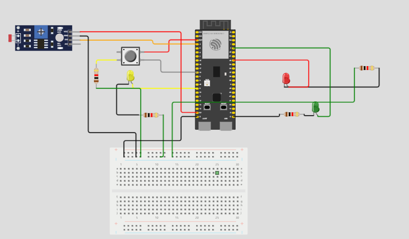

## Prova

O código utilizado na resolução da prova foi:

```cpp
#include <WiFi.h>
#include <HTTPClient.h>

#define LED_VERDE 2 // Pino utilizado para controle do led verda
#define LED_VERMELHO 40 // Pino utilizado para controle do led vermelho
#define LED_AMARELO 9 // Pino utilizado para controle do led azul
#define botaoPino  18  // numero do pino do botão
#define LDR_PIN  4  // numero do pino do botão do ldr

int botaoEstado = 0;  // variavel que lê o estado do botão

int threshold=600;

void setup() {

  // Configuração inicial dos pinos para controle dos leds como OUTPUTs (saídas) do ESP32
  pinMode(LED_VERDE,OUTPUT);
  pinMode(LED_VERMELHO,OUTPUT);
  pinMode(LED_AMARELO,OUTPUT);

  // Inicialização das entradas
  pinMode(botaoPino, INPUT); // Inicializando o botão como uma entrada

  digitalWrite(LED_VERDE, LOW);
  digitalWrite(LED_VERMELHO, LOW);
  digitalWrite(LED_AMARELO, LOW);

  Serial.begin(9600); // Configuração para debug por interface serial entre ESP e computador com baud rate de 9600

  WiFi.begin("Wokwi-GUEST", ""); // Conexão à rede WiFi aberta com SSID Wokwi-GUEST

  while (WiFi.status() != WL_CONNECTED) {
    delay(100);
    Serial.print(".");
  }
  Serial.println("Conectado ao WiFi com sucesso!"); // Considerando que saiu do loop acima, o ESP32 agora está conectado ao WiFi (outra opção é colocar este comando dentro do if abaixo)

  if(WiFi.status() == WL_CONNECTED){ // Se o ESP32 estiver conectado à Internet
    HTTPClient http;

    String serverPath = "http://www.google.com.br/"; // Endpoint da requisição HTTP

    http.begin(serverPath.c_str());

    int httpResponseCode = http.GET(); // Código do Resultado da Requisição HTTP

    if (httpResponseCode>0) {
      Serial.print("HTTP Response code: ");
      Serial.println(httpResponseCode);
      String payload = http.getString();
      Serial.println(payload);
      }
    else {
      Serial.print("Error code: ");
      Serial.println(httpResponseCode);
      }
      http.end();
    }

  else {
    Serial.println("WiFi Disconnected");
  }
}

void loop() {
  int ldrstatus=analogRead(LDR_PIN);
  // Verifica estado do botão
  botaoEstado = digitalRead(botaoPino);

  if(ldrstatus<=threshold){
    digitalWrite(LED_AMARELO, HIGH);
    delay(1000);

  }else{
    digitalWrite(LED_VERDE, HIGH);
    delay(3000);
    digitalWrite(LED_AMARELO, HIGH);
    delay(2000);
    digitalWrite(LED_VERMELHO, HIGH);
    delay(5000);
  }
  
  if (botaoEstado == HIGH) {
    if (ldrstatus <= threshold && digitalRead(LED_VERMELHO) == HIGH) {
      delay(1000);
      digitalWrite(LED_VERMELHO, LOW);
      digitalWrite(LED_VERDE, HIGH);
    }
  } else {
    Serial.println("Botão não pressionado!");
  }

}

```
Assim, os estados são quando estiver escuro o protótipo deve irá piscar o led amarelo a cada segundo e quando estiver claro os leds irão ativar o modo convencional e fazer a temporização alternando entre verde (3 segundos), amarelo (2 segundos) e vermelho (5 segundos), por fim quando estiver claro e o semáforo estiver no estado fechado  e o botão for pressionado, o semáforo deve abrir 1 segundo após o pressionamento do botão.

Segue a imagem do esquemática do circuito:



Por fim, o arquivo zip está anexado.